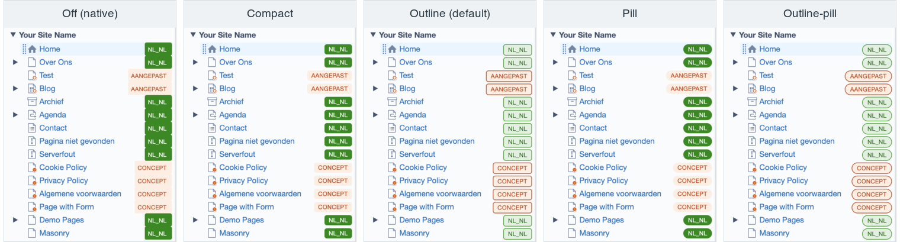
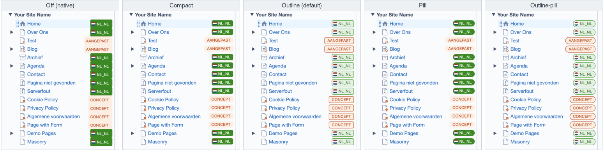

# Silverstripe Better Badges

Stop the CMS page-tree status/locale badges from merging into one solid vertical bar.

By default Silverstripe renders the page-tree badges (`Draft`, `Modified`, and — with
[Fluent](https://github.com/tractorcow-farm/silverstripe-fluent) — the locale badges)
absolutely positioned and touching, so down a longer tree they read as one continuous
coloured bar instead of a per-row status. This module gives them a little vertical
breathing room and a choice of styles, consistently across the page tree, the edit-view
header/breadcrumb and the list/gridfield views.



## Requirements

- `silverstripe/framework` ^6.0
- `silverstripe/admin` ^3.0

Works with or without [Fluent](https://github.com/tractorcow-farm/silverstripe-fluent) —
it styles the native status badges on their own, and softens the Fluent locale badges too
when Fluent is installed.

## Installation

```sh
composer require xddesigners/silverstripe-better-badges
```

No build step and no `dev/build` needed — it only ships CSS that is loaded into the CMS.

## Configuration

Pick a style (default `outline`). In YAML:

```yaml
XD\BetterBadges\BetterBadges:
  style: outline   # outline | outline-pill | compact | pill | off
```

Or in `app/_config.php`:

```php
use XD\BetterBadges\BetterBadges;
use SilverStripe\Core\Config\Config;

Config::modify()->set(BetterBadges::class, 'style', 'pill');
```

### Styles

| Style          | Looks like                                                                                      |
| -------------- | ----------------------------------------------------------------------------------------------- |
| `outline`      | **Default.** Compact + a light outline; every state softened to a tinted chip with a coloured border. |
| `outline-pill` | The outline treatment with fully rounded pill badges.                                           |
| `compact`      | Compact rounded rectangle, keeps the native solid fills.                                         |
| `pill`         | Compact, fully rounded, keeps the native solid fills.                                            |
| `off`          | Alias `none`. **Disabled** — loads no stylesheet; the CMS badges stay exactly as Silverstripe renders them (the first panel above). |

Every style except `off` adds the vertical spacing that breaks up the bar; they only differ in
the look. `off` leaves the native badges completely untouched — useful to compare, or to disable
the module on a specific environment (see below).

## Environment override

The style can also be set from `.env`, which **takes precedence over the YAML/PHP config**. This is
handy to override it per environment — e.g. turn the module off on one site — without changing config:

```
SS_BETTER_BADGES_STYLE="off"
```

Any value works (`outline`, `pill`, `off`, …). When the variable is set it wins; otherwise the
`style` config is used.

## Locale flags

With [Fluent](https://github.com/tractorcow-farm/silverstripe-fluent) installed, Better Badges can show
a small **country flag** inside each locale badge — derived from the locale's region, with the `xx_YY`
code kept beside it. It's **opt-in** and off by default. Enable it in YAML:

```yaml
XD\BetterBadges\BetterBadges:
  locale_flags: true
```

…or per environment from `.env` (takes precedence over the config):

```
SS_BETTER_BADGES_LOCALE_FLAGS="1"
```



The flag shape follows the badge style: a **circle** on the rounded `pill` / `outline-pill` styles, a
tiny-rounded **square** on the others. Flags are [flag-icons](https://github.com/lipis/flag-icons) SVGs
(MIT — see `client/flags/FLAG-ICONS-LICENSE.txt`), bundled, so any locale works offline.

Options:

| Config | Default | Does |
| --- | --- | --- |
| `locale_flags` | `false` | Turn flags on. (Or `SS_BETTER_BADGES_LOCALE_FLAGS` in `.env`.) |
| `locale_flags_shape` | `auto` | `auto` (circle for pill styles, square otherwise), or force `circle` / `square`. |
| `locale_flags_hide_code` | `false` | Show only the flag, hiding the `xx_YY` code. |
| `locale_flags_map` | `[]` | Override the flag per locale or language, e.g. `{ en: gb, en_US: us, eu: eu }`. |

The region is taken from the locale (`en_GB` → `gb`); language-only locales (`en`) or non-country
subtags (`zh_Hans`) show no flag unless mapped.

## Accessibility & high-contrast mode

The softened locale-badge colours already meet **WCAG AA** contrast (green 5.71, purple 7.38, red 6.29).
For stricter needs there is an **opt-in high-contrast mode** that darkens the locale-badge text to
**WCAG AAA** (≥ 7:1 — green 8.60, purple 9.03, red 8.18) while keeping the same design. The native
status-badge colours are Silverstripe's own and are left untouched.

```yaml
XD\BetterBadges\BetterBadges:
  high_contrast: true
```

…or per environment from `.env` (takes precedence over the config):

```
SS_BETTER_BADGES_HIGH_CONTRAST="1"
```

The overlay loads in addition to the chosen style, so it layers on top of any of them (including flags).

All of the styling wins on CSS **specificity alone — no `!important`** — by scoping every rule under the
admin's `.cms` body and mirroring the CMS's own per-view badge selectors (edit-view tree, page list) with
one extra class. So it overrides the framework/Fluent badge rules cleanly without fighting your own CSS.

## License

BSD-3-Clause.
